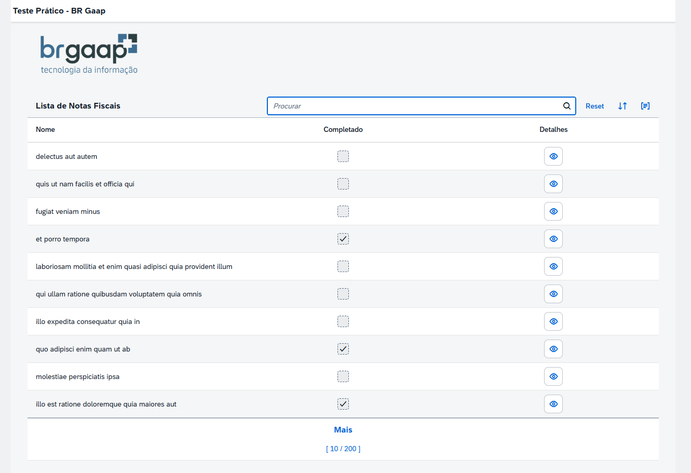
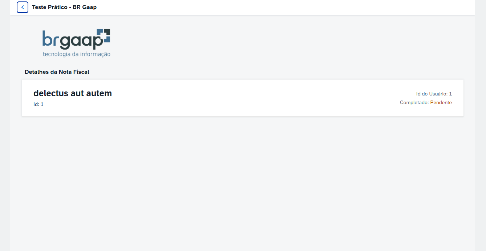

# SAPUI5 - Teste Prático (BRGAAP)

Este projeto é uma aplicação desenvolvida com **SAPUI5** que consome dados da API pública [JSONPlaceholder](https://jsonplaceholder.typicode.com/todos). O objetivo é listar e detalhar notas fiscais simuladas (todos), com funcionalidades de busca, ordenação, agrupamento e exibição de detalhes individuais.

## 📸 Demonstração

> A aplicação exibe uma tabela com "notas fiscais" contendo título, status de completado e botão para visualizar detalhes.

## ✨ Funcionalidades

- 🔍 **Filtro de busca** por título
- 📋 **Listagem** de notas fiscais com:
  - Título (`title`)
  - Status (`completed`)
  - Detalhes (`id`, `userId`)
- ✅ **CheckBox** exibindo se a nota foi completada
- 📑 **Detalhes da nota fiscal** em uma página separada
- ↕️ **Ordenar** em ordem alfabética (`title`)
- 🧑 **Agrupar** por ID de usuário (`userId`)
- ♻️ **Resetar filtros**

## 🖼️ Capturas de Tela

### 📋 Listagem de Notas Fiscais


### 🧾 Detalhes da Nota Fiscal


## 🛠️ Tecnologias utilizadas

- JavaScript
- [SAPUI5](https://sapui5.hana.ondemand.com/)
- [JSONModel](https://sapui5.hana.ondemand.com/#/api/sap.ui.model.json.JSONModel)
- API: [JSONPlaceholder](https://jsonplaceholder.typicode.com/)

## 🚀 Como rodar o projeto localmente

1. Instale o [UI5 CLI](https://sap.github.io/ui5-tooling/pages/GettingStarted/) se ainda não tiver:
   ```bash
   npm install --global @ui5/cli
Clone este repositório:

bash
Copiar
Editar
git clone https://github.com/seu-usuario/nome-do-repositorio.git
cd nome-do-repositorio
Inicie o servidor local:

bash
Copiar
Editar
ui5 serve -o index.html
Acesse a aplicação no navegador: http://localhost:8080

📌 Observações
A API usada não retorna dados reais de notas fiscais, mas sim uma estrutura simulada.

👨‍💻 Autor
Daniel Souza
Desenvolvedor Web Fullstack